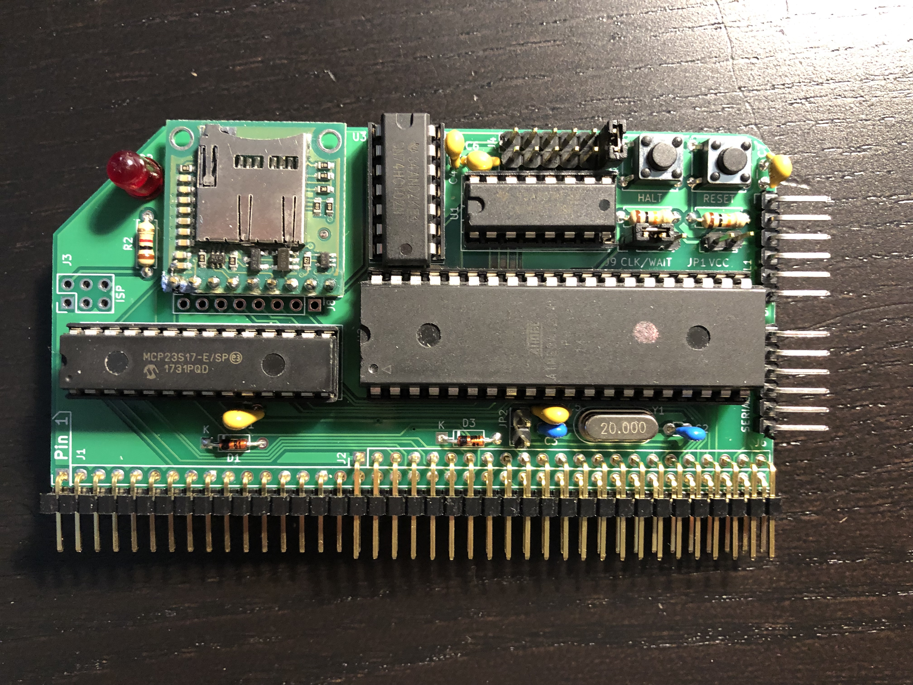

# z80ctrl

This is an AVR-based bootloader, disk emulator, serial I/O device, and debugger for a Z80-based computer.  The MIT-licensed firmware is flexible and can be the basis of your own custom SBC or breadboard computer, but I also designed a plugin module for the [RC2014](https://rc2014.co.uk/) retrocomputer kit. 
 
 I have made a [series of videos](https://www.youtube.com/watch?v=M8EIAxMpA-o&list=PLwP_dSEH4Oi_jAljWQ1H-TBiBL34LqYYm) demonstrating the design and features of the system.

## Software

The AVR firmware contains a built-in monitor program to allow control of the Z80.  When the AVR starts up, it presents a `z80ctrl>` prompt. The following commands are provided:

- Dump, disassemble, or fill memory (`dump`, `disasm`, `fill`)
- List files on the SD card (`dir`)
- Load and save Intel HEX files (`loadhex`, `savehex`)
- Mount, unmount, and boot from disk images (`mount`, `unmount`, `sboot`, `dboot`)
- Set breakpoints and watchpoints, and debug a program (`break`, `watch`, `debug`, `step`)
- Start the Z80 running from any address (`run`)
- Clear the screen (`cls`)
- List available commands (`help`)

Watch this [YouTube video](https://www.youtube.com/watch?v=5hJ0k5ZuQRE) for a demo of the monitor software.

## Hardware

I have created a [schematic](hardware/z80ctrl.pdf) and PCB design for the RC2014 plug-in module in KiCad. All the design files are located in the `hardware` subdirectory. You can order PCBs directly on [OSH Park](https://oshpark.com/shared_projects/Bn3c0pEt). If you want to manufacture them elsewhere, you will need to generate Gerber files from the KiCad project.

My board will replace the clock, serial, rom, and CF boards, so that all you need for a fully functional computer is my module plus the Backplane Pro, Z80 CPU board, and 64K RAM board.

Besides the reduced part count, z80ctrl has other advantages over the stock RC2014:
- Read CP/M disk images off a FAT32-formatted SD Card 
- Full compatiblity with unmodified Altair disk images from the SIMH emulator project 
- Single-step debugging, breakpoints, and watchpoints to trace Z80 execution in real-time. 
- Easy testing of software by loading Intel HEX files from SD Card. No need to burn ROMs!

## More Information

This README was getting too long so much of the information that was previously here has been moved to separate wiki pages:

- [Compatible Z80 Software](https://github.com/jblang/z80ctrl/wiki/Compatible-Z80-Software)
- [Hardware Design Notes](https://github.com/jblang/z80ctrl/wiki/Hardware-Design-Notes)
- [Software Design Notes](https://github.com/jblang/z80ctrl/wiki/Software-Design-Notes)
- [Known Hardware Issues](https://github.com/jblang/z80ctrl/wiki/Known-Hardware-Issues)
- [Planned Features](https://github.com/jblang/z80ctrl/wiki/Planned-Features)
- [Breadboard Instructions](https://github.com/jblang/z80ctrl/wiki/Breadboard-Configuration)
- Check the [Wiki Index](https://github.com/jblang/z80ctrl/wiki) for other topics.

More information on other sites:

- [Hackaday Project Page](https://hackaday.io/project/158338-z80ctrl)
- [YouTube Playlist](https://www.youtube.com/watch?v=M8EIAxMpA-o&list=PLwP_dSEH4Oi_jAljWQ1H-TBiBL34LqYYm)
- [Google Groups Thread](https://groups.google.com/forum/#!topic/rc2014-z80/yc8g_ugiseo). Please use this thread or the Hackaday Project Page to ask for help.
- [Older Google Groups Thread](https://groups.google.com/forum/#!searchin/rc2014-z80/z80ctrl%7Csort:date/rc2014-z80/wi8MCKlJdlo/xWQDF-IaAgAJ)
- [Even Older Google Groups Thread](https://groups.google.com/forum/#!searchin/rc2014-z80/z80ctrl%7Csort:date/rc2014-z80/EukbCJAxxIY/uYzqrVTcAgAJ)
- [OSH Park Shared Project (REV2)](https://oshpark.com/shared_projects/Bn3c0pEt)
- [Bill of Materials](https://docs.google.com/viewer?a=v&pid=forums&srcid=MDg4ODQwMTE2ODM0ODg2OTc5MTYBMDYxMjQ0OTAwNDMxMzE1MTEyNTYBd3dvUkxweVlBd0FKATAuMQEBdjI&authuser=0)

## License

Copyright 2018 J.B. Langston

Permission is hereby granted, free of charge, to any person obtaining a copy of this software and associated documentation files (the "Software"), to deal in the Software without restriction, including without limitation the rights to use, copy, modify, merge, publish, distribute, sublicense, and/or sell copies of the Software, and to permit persons to whom the Software is furnished to do so, subject to the following conditions:

The above copyright notice and this permission notice shall be included in all copies or substantial portions of the Software.

THE SOFTWARE IS PROVIDED "AS IS", WITHOUT WARRANTY OF ANY KIND, EXPRESS OR IMPLIED, INCLUDING BUT NOT LIMITED TO THE WARRANTIES OF MERCHANTABILITY, FITNESS FOR A PARTICULAR PURPOSE AND NONINFRINGEMENT. IN NO EVENT SHALL THE AUTHORS OR COPYRIGHT HOLDERS BE LIABLE FOR ANY CLAIM, DAMAGES OR OTHER LIABILITY, WHETHER IN AN ACTION OF CONTRACT, TORT OR OTHERWISE, ARISING FROM, OUT OF OR IN CONNECTION WITH THE SOFTWARE OR THE USE OR OTHER DEALINGS IN THE SOFTWARE.
